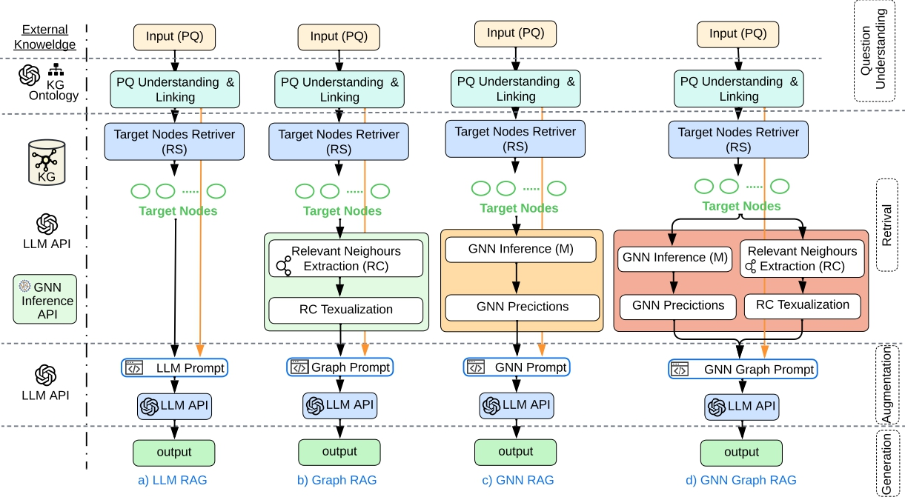
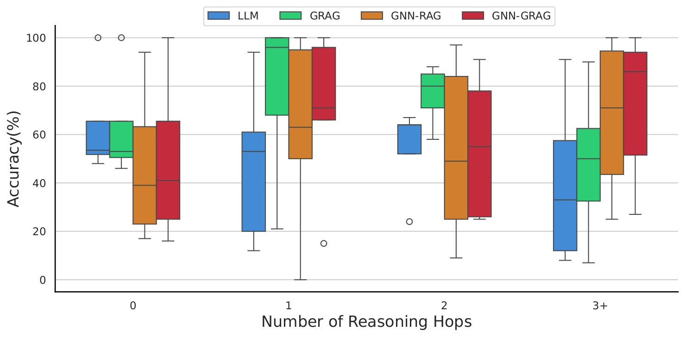

<h1>Abstract</h1>
Domain-specific reasoning over Knowledge Graphs (KGs) presents a substantial challenge for Large Language Models (LLMs) due to the complexity of graph structures and the abundance of irrelevant information. Existing LLM reasoning methods often neglect the structural semantics of KG fact, missing
the opportunity to leverage their rich relational context. This paper addresses the task of Predictive Query Answering over knowledge graphs by
proposing an Inductive Graph Retrieval-Augmented-Generation (Inductive Graph-RAG) pipeline. Our method integrates Graph Neural Networks (GNNs) and RAG to answer predictive queries, where missing facts are dynamically predicted using a pre-trained GNN model. Theoretical analysis and
problem formulation are conducted to understand GraphRAG’s capabilities. A lightweight KG context retrieval phase is incorporated to extract relevant triples and integrate GNN inference to predict the potential answers. The augmentation phase enriches user prompts with relevant context to improve
one-off-the-shelf LLM reasoning performance in domain-specific knowledge. To evaluate our approach, we introduce a diverse taxonomy of predictive queries spanning four distinct KG domains, forming a challenging dataset with varied characteristics. Extensive experiments demonstrate that InductiveGRAG significantly improves LLM reasoning capabilities and performance.

  
   
  <em>The Inductive Graph RAG Pipeline Phases</em>

  
   
  <em>The accuracy of predictive query answering versus the required reasoning depth using 4 pipelines LLM, GraphRAG, GNN-RAG, and GNN Graph-RAG. The higher the 
      reasoning depth the clear need to incorporate the structural embedding via GNN to improve the LLM reasoning ability.</em>

