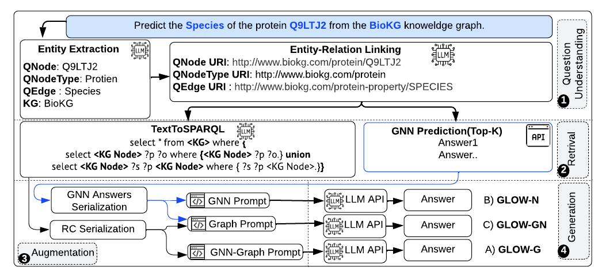
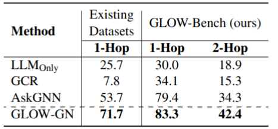

<h2> Leveraging LLM-GNN Integration for Open-World Question Answering over Knowledge Graphs </h2>
<h1>Abstract</h1>
Knowledge Graph Question Answering (KGQA) aims to answer natural language questions using structured knowledge from knowledge graphs (KGs). Large Language Models (LLMs), with their strong language understanding and reasoning abilities, offer a promising way to enhance KGQA—especially in domain-specific settings —by integrating symbolic and structured information. However, most existing approaches assume a closed world, where missing facts are treated as false and answers must exist in the KG, which limits their effectiveness in real-world scenarios with incomplete data. To address this, we introduce GLOW, a system for open-world KGQA that combines LLMs with graph neural networks (GNNs).  A pre-trained GNN predicts top-k candidate answers based on graph structure, which are embedded into a structured prompt to guide the LLM in reasoning over both text and topology.  While current KGQA benchmarks focus on simple, shallow questions within limited domains, they fail to test the deeper reasoning needed for open-world settings.  To fill this gap, we also present a new benchmark of 1,000 multi-hop questions spanning diverse domains and requiring inference over incomplete KGs. 
 Experiments across four benchmarks—including our new dataset—show that GLOW significantly outperforms state-of-the-art LLMs (e.g., GPT-4o-mini) and graph-based QA systems,  achieving up to 53.3% and an average of 38% performance improvement.
<p align="center" width="100%">
  
  <br>
  <em>The GLOW-QA Pipeline Phases</em>
</p>
<p align="center" width="30%">
  
  <br>
</p>

### scripts
To RUN GLOW-QA Pipelines
```python
python src/GLOW.py  --llm_model  qwen3:8b --dataset_name biokg --runs 3 --glow-v All --top-k 3
```
- <p>llm_model choices=["gpt-4o-mini","deepseek-chat","deepseek-r1","granite3.3","gemini-1.5-flash","llama3.2:3b","qwen3:8b","phi4-mini"]</p>
- <p>dataset_name choices=['biokg','linkedIMDB','yago4-person','yago4-creativwork','crunchbase','arxiv2023','ogbnArxiv','ogbnProduct']</p>
- <p>glow-v choices=['L','GN','G','N','LLM','All']</p>